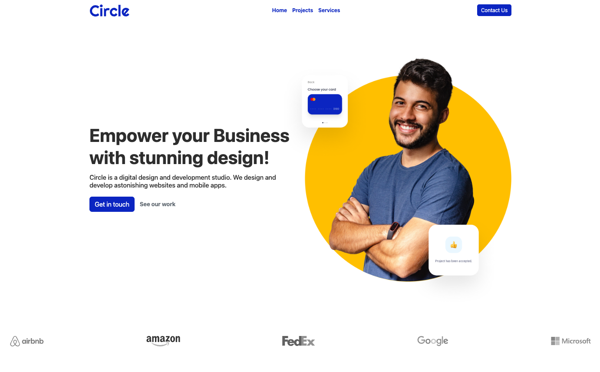

# 🌐 Circle Agency – Portfolio Website

Welcome to **Circle Agency**, a responsive and modern portfolio website built with HTML, CSS, Bootstrap, and vanilla JavaScript.

## 🚀 Live Demo

Check out the live version of the site:  
👉 [https://stirring-axolotl-9f9ab9.netlify.app](https://stirring-axolotl-9f9ab9.netlify.app)

## 📸 Preview

 

---

## ✨ Features

- 💼 Multi-page website: Home, Projects, Contact
- 📱 Fully responsive layout
- 🖌️ Styled using Bootstrap and custom CSS
- 📇 Contact form with JavaScript validation
- 🎯 Section linking with anchor tags
- 🔁 Dynamic content loading via JavaScript (header, footer, newsletter)

---

## 🛠️ Tech Stack

- **HTML5**
- **CSS3 / Bootstrap 5**
- **JavaScript (Vanilla)**  
- **Netlify** for deployment

---

## 📁 Project Structure

<pre><code>
/assets
    /logos
    /services-section
    /projects-section
    /newsletter
    /testimonial-section
    /hero-section
/components
    footer.html
    navbar.html
    newsletter.html
/css
    style.css
/js
    main.js
    loadFooter.js
    loadNavbar.js
    loadNewsletter.js
    project.js
/pages
    contact.html
    1.html
    2.html
    3.html
    4.html
index.html
README.md
</code></pre>

---

## 🔧 Setup

To run the project locally:

```bash
git clone https://github.com/Salva985/circle-agency.git
cd circle-agency
```

## ✍️  Author

**Salvatore Marchese**  
GitHub: [@Salva985](https://github.com/Salva985)

Portfolio: [circleagency.netlify.app](https://stirring-axolotl-9f9ab9.netlify.app)  
LinkedIn: [linkedin.com/in/salvatore-marchese](https://linkedin.com/in/your-profile)

## 📄 License

No license. This project is for educational purposes.